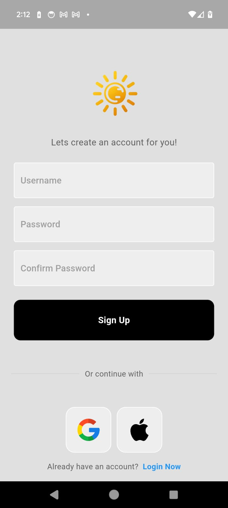
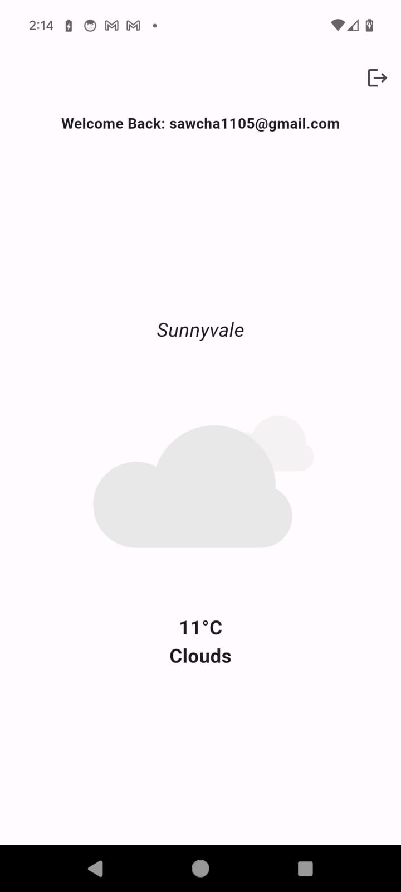
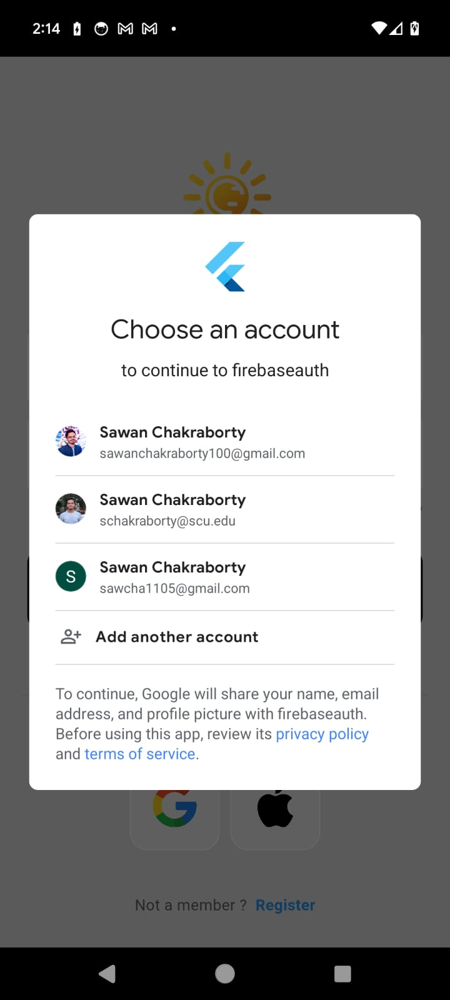
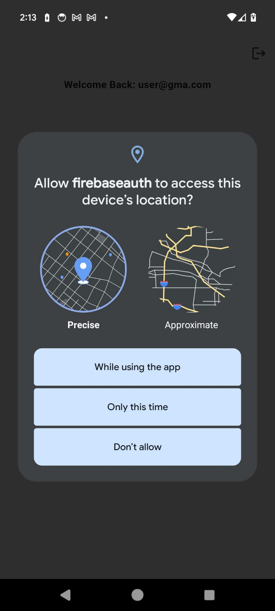
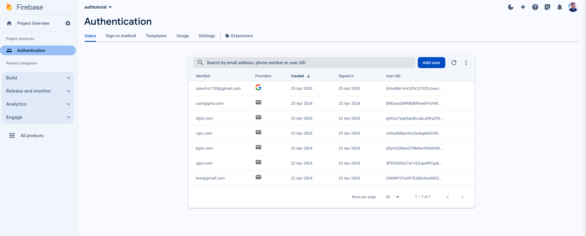

# Weather App

Weather App is a mobile application developed using Flutter that offers real-time weather updates tailored to the user's current location. Leveraging Firebase, the app provides secure user registration and authentication, allowing personalized and accurate weather forecasts.

## Features

- **User Authentication**: Secure login and registration functionality using Firebase Authentication.
- **Real-Time Weather**: Displays current weather conditions including temperature, humidity, and wind speed based on the user's GPS location.
- **User-Friendly Interface**: Easy-to-navigate interface providing a seamless user experience.
- **Customizable Settings**: Allows users to customize the app settings, such as units of measurement (Celsius).

## Screenshots

<div style="display: flex; flex-wrap: wrap; justify-content: space-around;">
    
    
    
    
    
</div>




## Technologies Used

- **Flutter**: For creating the mobile application.
- **Firebase**:
  - **Firebase Authentication**: For managing user registration and login.
  - **Firebase Firestore**: Optionally used for storing user preferences and additional data.
- **OpenWeatherMap API**: For fetching real-time weather data.

## Setup

1. **Clone the repository**:
    ```bash
    git clone https://github.com/yourgithubusername/weather-app.git
    cd weather-app
    ```

2. **Install dependencies**:
    ```bash
    flutter pub get
    ```

3. **Configure Firebase**:
    Download `google-services.json` for Android or `GoogleService-Info.plist` for iOS and place it in the respective directory.

4. **Run the app**:
    ```bash
    flutter run
    ```

## Usage

- **Register/Login**: Authenticate to access your local weather.
- **View Weather**: Weather details appear on the home screen after login.

## Contributing

Feel free to fork, add features, and submit pull requests.
